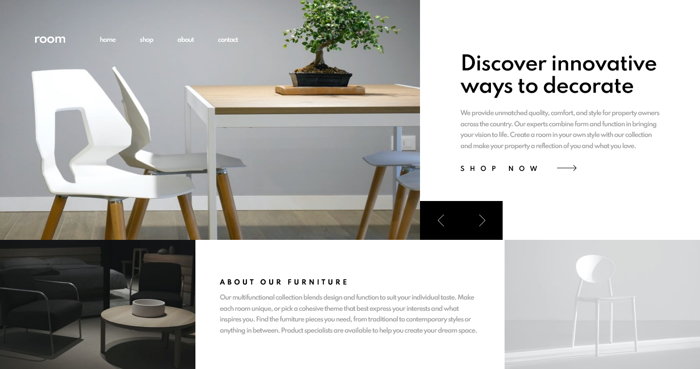

# Frontend Mentor - Room homepage solution

This is a solution to the [Room homepage challenge on Frontend Mentor](https://www.frontendmentor.io/challenges/room-homepage-BtdBY_ENq). Frontend Mentor challenges help you improve your coding skills by building realistic projects. 

## Table of contents

- [Overview](#overview)
  - [The challenge](#the-challenge)
  - [Screenshot](#screenshot)
  - [Links](#links)
- [My process](#my-process)
  - [Built with](#built-with)
  - [Useful resources](#useful-resources)
- [Author](#author)
- [Acknowledgments](#acknowledgments)

**Note: Delete this note and update the table of contents based on what sections you keep.**

## Overview

### The challenge

Users should be able to:

- View the optimal layout for the site depending on their device's screen size
- See hover states for all interactive elements on the page
- Navigate the slider using either their mouse/trackpad or keyboard

### Screenshot

### Links

- Solution URL: [https://github.com/Tam-star/RoomHomepage](https://your-solution-url.com)
- Live Site URL: [https://tam-star.github.io/RoomHomepage/](https://your-live-site-url.com)

## My process

### Built with

- Semantic HTML5 markup
- CSS custom properties
- Sass
- Flexbox
- [React](https://reactjs.org/) - JS library
- [Create React App](https://github.com/facebook/create-react-app)

**Note: These are just examples. Delete this note and replace the list above with your own choices**

## Author

- Website - [Tamara Wenner](https://tamarawenner.com)
- Frontend Mentor - [@Tam-star](https://www.frontendmentor.io/profile/Tam-star)
- LinkedIn - [@TamaraWenner](https://www.linkedin.com/in/tamara-wenner-40b9b71b6/)

## Acknowledgments

Thanks Frontend Mentor for this challenge ! 

